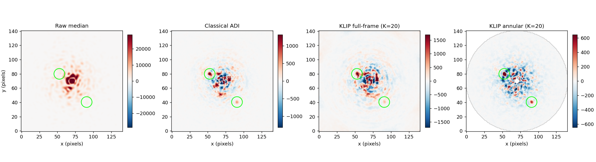

# exoklip

[](https://github.com/francoisb12/exoklip/actions/workflows/ci.yml)
[](https://www.python.org/)
[](LICENSE)

Imagerie directe d'exoplanètes : **post-traitement KLIP/ADI, statistiques de
détection honnêtes, et un simulateur en optique de Fourier** pour tout tester
sans télescope.

Détecter une planète à côté de son étoile, c'est extraire une source dix mille à
un million de fois plus faible, à une fraction de seconde d'arc. La planète
n'est pas cachée par l'obscurité mais par les **speckles** — de la lumière
stellaire diffractée qui imite des sources ponctuelles et ne s'efface pas par
intégration. Ce package implémente la machinerie standard pour les supprimer et,
tout aussi important, pour énoncer honnêtement ce qui a été détecté ou non.

Dépendances dures : **numpy et scipy uniquement**. astropy, matplotlib et tqdm
sont optionnels et importés paresseusement.

📖 [English README](README.md)



*La même séquence simulée de 60 poses, réduite de quatre façons. Les cercles
verts marquent les deux compagnons injectés. Regardez les échelles de couleur :
de ±25 000 pour la médiane brute à ±650 après KLIP annulaire — deux ordres de
grandeur de lumière stellaire supprimés.*

---

## Installation

```bash
git clone https://github.com/francoisb12/exoklip.git
cd exoklip
pip install -e ".[plot]"
```

`pip install -e .` seul donne accès à tous les algorithmes ; l'extra `plot`
n'ajoute que les figures, et `fits` ajoute astropy pour lire des données réelles.

## Démarrage rapide

```python
from exoklip import SimConfig, simulate_adi_sequence, klip_adi, snr_map, detect_sources

sim = simulate_adi_sequence(SimConfig(n_frames=60, size=141, n_planets=2,
                                      planet_separations=(20.0, 36.0),
                                      planet_pas=(60.0, 215.0),
                                      planet_contrasts=(2e-3, 5e-4), seed=11))

image = klip_adi(sim["cube"], sim["angles"], fwhm=sim["fwhm"], n_modes=20, delta_rot=0.5)
snr = snr_map(image, sim["fwhm"], r_min=10, r_max=55)

for c in detect_sources(snr, sim["fwhm"], threshold=5.0, image=image):
    print(f"r = {c['radius']:.2f} px, PA = {c['pa']:.2f} deg, SNR = {c['snr']:.2f}")
```

```
r = 35.94 px, PA = 215.01 deg, SNR = 16.16
r = 19.63 px, PA = 60.53 deg, SNR = 8.66
```

Les deux compagnons sont retrouvés dans une séquence où une simple médiane ne
montre rien. La chaîne complète — simulation, trois réductions, détection,
throughput, courbe de contraste, cinq figures — tourne en environ 45 secondes :

```bash
python examples/demo_full.py
```

---

## La physique en trente lignes

**Le problème.** Un Jupiter jeune est 10⁻⁴ à 10⁻⁶ fois moins brillant que son
étoile, à 0,1–1 seconde d'arc. Un coronographe supprime le cœur stellaire, mais
les erreurs de front d'onde résiduelles du télescope diffusent la lumière en un
halo de **speckles** — des artefacts de diffraction cohérents, chacun ayant
exactement la forme d'une source ponctuelle. Ce n'est pas du bruit aléatoire :
ils persistent des minutes à des heures, donc poser plus longtemps ne les
élimine pas. Ce sont eux qui limitent tout.

**L'astuce : l'imagerie différentielle angulaire** (Marois et al. 2006). On
observe en mode *pupil-tracking* : on laisse le champ tourner avec le ciel au
lieu de compenser. Les speckles viennent de l'optique, ils restent donc figés
sur le détecteur. Le compagnon est sur le ciel, il décrit donc un arc. Les deux
deviennent séparables — on construit un modèle de l'étoile à partir de la
séquence elle-même, on le soustrait, on dérote chaque résidu vers une
orientation commune, et on combine. Le compagnon s'additionne, pas les speckles.

**KLIP** (Soummer, Pueyo & Larkin 2012) choisit ce modèle de façon optimale.
Pour chaque pose, on construit une base de Karhunen–Loève à partir des vecteurs
propres de la covariance des *autres* poses, et on projette sur les `K` premiers
modes. La troncature à `K` est tout l'enjeu : les premiers modes capturent la
PSF stellaire commune à toutes les poses, les suivants commencent à décrire le
bruit propre de chaque pose.

**Le piège : l'auto-soustraction.** Le compagnon est présent dans les poses qui
servent à bâtir le modèle, donc une partie est soustraite avec l'étoile. Plus de
modes, c'est un meilleur modèle stellaire *et* moins de compagnon restant. Deux
conséquences, toutes deux implémentées ici :

- Un **seuil de rotation** (`delta_rot`) : une pose n'entre dans la bibliothèque
  de références que si le compagnon s'est déplacé d'une fraction donnée de FWHM
  entre les deux expositions. C'est ce qui protège les compagnons serrés.
- Une **correction de throughput** : on mesure quelle fraction d'un compagnon
  injecté de flux connu survit à la *même* réduction, et on divise. Une courbe
  de contraste sans cette correction est optimiste d'un facteur 2 à 10 à faible
  séparation. Mesuré ici : 0,43 à 8 pixels, remontant à 0,88 à 48.

**Et les statistiques.** À trois éléments de résolution de l'étoile, il n'y a
qu'environ 18 échantillons de bruit indépendants disponibles ; à 1,5, seulement
9. Estimer un niveau de bruit sur 9 échantillons puis seuiller à « 5σ » comme
s'il était connu exactement surestime la significativité. Le traitement correct
est un test *t* de Student à deux échantillons (Mawet et al. 2014), qui coûte
une pénalité divergeant quand la séparation diminue :

| Éléments de résolution | Rapport requis pour un vrai 5σ |
|---|---|
| 60 (au large) | **5,7** |
| 20 | **8,2** |
| 10 (≈1,6 λ/D) | **23,5** |

Annoncer le rapport brut comme un « sigma » près de l'étoile est la façon la
plus courante de publier une détection qui n'existe pas.

---

## Quand KLIP vaut-il vraiment le coup ?

Un résultat obtenu en construisant ce package, mesuré sur le simulateur en
faisant varier la vitesse de décorrélation du champ de speckles quasi-statique :

| Dérive des speckles sur la séquence | KLIP vs ADI classique |
|---|---|
| 0,05 (optique figée) | **0,82×** — cADI gagne |
| 0,5 | 1,05× |
| 1,0 | 1,58× |
| 2,0 (forte dérive) | **2,29×** |

Sur un champ de speckles parfaitement figé, la médiane temporelle est déjà un
modèle de PSF optimal, et KLIP — qui ajuste un modèle par pose — ne fait
qu'ajouter du bruit d'ajustement. KLIP paie précisément parce que l'optique
réelle dérive : température, flexions et boucle d'optique adaptative déplacent
toutes les aberrations pendant les heures nécessaires à accumuler de la rotation
de champ. Son bruit résiduel est resté quasi constant sur toute cette plage
pendant que celui de cADI se dégradait d'un facteur trois.

C'est pourquoi le `static_drift` par défaut du simulateur vaut 0,8 et non une
valeur qui flatterait l'algorithme.

---

## Ce qui n'allait pas dans le prototype d'origine

Ce package est né d'un script de 97 lignes (`b.py`) qui faisait une PCA
scikit-learn sur des patchs spatiaux recouvrants d'un unique JPEG en appelant ça
du KLIP. Chaque défaut ci-dessous était réel, et chaque ligne nomme son
remplaçant.

| Problème | Conséquence scientifique | Remplacé par |
|---|---|---|
| **Une PCA sur les patchs d'une seule image n'est pas du KLIP.** Avec une seule pose, il n'y a ni bibliothèque de références ni rotation de champ : rien ne distingue une planète d'un speckle — les deux sont compacts, brillants et localement atypiques. | Fondamental : la méthode ne peut pas faire ce qu'elle prétend, et sa sortie est une carte du halo de speckles. | `klip.py` + `adi.py` : une vraie bibliothèque de références sur une séquence en rotation |
| La boucle d'itérations réajuste la PCA sur des données inchangées | Les 10 « itérations » identiques ; la boucle était décorative | `legacy/b_fixed.py` — exclut itérativement les patchs signalés pour que le modèle converge |
| `skimage.measure.label` appliqué à un tableau RGB de flottants | Chaque valeur flottante distincte devient sa propre région ; la liste de détections est du bruit | `detect.py` seuille d'abord vers un masque **binaire**, puis étiquette |
| Patchs recouvrants écrits avec `=` | Les derniers patchs écrasent les précédents ; l'essentiel du calcul est jeté | Accumulation du résidu divisée par une carte de recouvrement |
| Seuil au 95ᵉ percentile de l'erreur | Signale toujours exactement 5 % de l'image, planète ou pas — il ne peut pas répondre « rien trouvé » | `metrics.significance_threshold` : Student-*t* à taux de faux positifs déclaré |
| `inverse_transform` par patch dans une boucle Python sur ~259 000 patchs | Des minutes pour une opération vectorisable | Entièrement vectorisé |
| Trois canaux couleur pour un détecteur infrarouge monochrome | 3× le coût pour des données redondantes | Réduit à un seul plan |
| `resize(image, (512, 512))` | Détruit l'échantillonnage de la PSF dont dépend toute l'analyse | Recadrer, jamais redimensionner |
| Lecture d'un JPEG 8 bits de prévisualisation de l'archive Keck | 256 niveaux ne peuvent pas contenir un signal à 10⁻⁵ de contraste ; la planète est quantifiée avant tout algorithme | `io.load_fits` + un avertissement explicite dans `io.load_image_legacy` |

`legacy/b_fixed.py` conserve l'idée d'origine (analyse d'une image unique) et
corrige les huit bugs d'implémentation, avec un encadré expliquant ce qu'une
telle méthode peut et ne peut pas faire légitimement. La détection d'anomalies
par patchs sur une seule pose est un outil raisonnable — pour trouver des rayons
cosmiques, des défauts de détecteur ou des structures étendues. Ce n'est pas de
la détection de planètes.

---

## Tour de l'API

| Module | Contenu |
|---|---|
| `simulate` | `simulate_adi_sequence`, `SimConfig` — pupille, écran de phase de Kolmogorov, coronographe de Lyot, bruits de photon et de lecture |
| `klip` | `klip_basis`, `klip_residual`, `klip_annular`, `klip_fullframe`, `rotation_threshold_mask` |
| `adi` | `median_adi` (cADI), `pca_adi`, `klip_adi`, `optimize_n_modes` |
| `metrics` | `snr_student`, `snr_map`, `significance_threshold`, `noise_profile`, `throughput`, `contrast_curve`, `aperture_flux` |
| `detect` | `detect_sources`, `negfc_flux` (compagnon négatif), `characterize` |
| `psf` | `airy_2d`, `moffat_2d`, `gaussian_2d`, `fit_gaussian_psf`, `normalize_psf`, `fwhm_lambda_over_d` |
| `inject` | `inject_companion`, `inject_companions_cube`, `remove_companion`, `companion_position` |
| `preproc` | `bad_pixel_correction`, `find_star_center` (gaussien / **Radon** / symétrie), `cube_recenter`, `frame_selection`, `temporal_binning` |
| `io` | `load_fits`, `parallactic_angle`, `parallactic_angles_from_headers` (preset Keck/NIRC2), décodeur PNG natif |
| `plotting` | `plot_adi_principle`, `plot_reduction_summary`, `plot_snr_map`, `plot_contrast_curve`, `plot_throughput` |
| `rotation` | `frame_rotate`, `cube_derotate`, `frame_shift`, `cube_collapse` |
| `core` | géométrie, masques annulaires et sectoriels, `n_resolution_elements` |

### Conventions

- Images `(y, x)`, cubes `(n_poses, y, x)`, float64 en interne.
- Angles en **degrés** partout dans l'API publique.
- Angle de position : **0 = Nord = `+y`, croissant vers l'Est = `-x`.**
- `cube_derotate` tourne la pose *i* de `-angles[i]` (convention VIP/pyKLIP).
- **Le contraste est un rapport de flux dans une ouverture de diamètre FWHM.**
  `normalize_psf` garantit que le template porte exactement 1,0 dans une telle
  ouverture, ce qui rend chaque argument `flux` directement interprétable.

---

## Utiliser des données réelles

Récupérez les **FITS** depuis la [Keck Observatory Archive](https://koa.ipac.caltech.edu/),
pas les JPEG de prévisualisation — ils sont en 8 bits et ne peuvent pas contenir
le signal.

```python
from exoklip.io import load_cube_from_dir, parallactic_angles_from_headers
from exoklip.preproc import bad_pixel_correction, cube_recenter
from exoklip import klip_adi, snr_map, normalize_psf

cube, headers = load_cube_from_dir("data/N2.*.fits")
angles = parallactic_angles_from_headers(headers, keys="NIRC2")
cube = bad_pixel_correction(cube)
cube, shifts = cube_recenter(cube, fwhm=4.5, method="radon")   # 'radon' résiste à la saturation
psf, star_flux, fwhm = normalize_psf(pose_de_calibration_non_saturee)
image = klip_adi(cube, angles, fwhm=fwhm, n_modes=20, delta_rot=1.0)
```

Deux pièges classiques : `star_flux` doit être corrigé du rapport de temps de
pose et de toute densité neutre entre l'image de calibration et les poses
scientifiques, sinon tous les contrastes sont décalés d'un facteur constant ; et
les angles parallactiques doivent être *déroulés* à travers la discontinuité
180°/−180°, ce que fait `parallactic_angles_from_headers`.

Voir `examples/demo_real_data.py`.

## Lire les résultats

- **La carte de SNR, pas l'image réduite.** Le bruit d'une image réduite varie
  de plusieurs ordres de grandeur avec la séparation : un seuil unique dessus
  n'a aucun sens.
- **Un rapport n'est pas un sigma.** `detect_sources` renvoie
  `threshold_5sigma` à côté de `snr` exactement pour ça. Comparez-les.
- **Une courbe de contraste décrit une réduction précise**, y compris ses
  `n_modes` et `delta_rot`. La citer sans ces valeurs, ou sans correction de
  throughput, ne dit pas grand-chose.
- **Les résidus sont signés.** La sur-soustraction apparaît en lobes négatifs de
  part et d'autre d'une source ; c'est pourquoi les figures utilisent une
  palette divergente centrée sur zéro.

## Limites

Énoncées honnêtement :

- Pas d'imagerie différentielle spectrale, pas de RDI (étoile de référence).
- Pas de cartes de détection à modèle direct (ANDROMEDA, PACO, KLIP-FM). Le
  biais astrométrique et photométrique est traité par NEGFC, standard mais plus
  lent et sans budget d'erreur analytique.
- Le simulateur relève de l'optique de Fourier avec une décomposition de phase
  prescrite, pas d'une simulation d'optique adaptative bout en bout : ni boucle
  temporelle réelle, ni scintillation, ni effets chromatiques, ni cosmétique de
  détecteur réaliste.
- `negfc_flux` lance une réduction complète par évaluation de la fonction :
  comptez quelques centaines de réductions par compagnon.
- Non validé contre une réduction publiée de données réelles. Toutes les
  affirmations de justesse reposent sur des tests unitaires, des vérifications
  analytiques et des comparaisons avec des implémentations indépendantes — c'est
  une preuve plus faible que reproduire un résultat connu sur le ciel.

## Tests

```bash
pytest -q
```

52 tests, environ 9 secondes. Ce sont des tests numériques, pas des smoke tests :
la base KL est vérifiée orthonormée à 1,1e-15, KLIP est comparé à une
implémentation SVD écrite indépendamment à 2e-15, les compagnons injectés
doivent revenir à l'angle de position demandé pour les huit angles cardinaux et
diagonaux, et la statistique de SNR est vérifiée normale centrée réduite sur du
bruit pur par Monte-Carlo.

## Références

- Marois, C., Lafrenière, D., Doyon, R., Macintosh, B. & Nadeau, D. 2006, *ApJ*, **641**, 556 — imagerie différentielle angulaire
- Lafrenière, D., Marois, C., Doyon, R., Nadeau, D. & Artigau, É. 2007, *ApJ*, **660**, 770 — LOCI et le critère de rotation
- Soummer, R., Pueyo, L. & Larkin, J. 2012, *ApJL*, **755**, L28 — KLIP
- Amara, A. & Quanz, S. P. 2012, *MNRAS*, **427**, 948 — PYNPOINT
- Pueyo, L. 2016, *ApJ*, **824**, 117 — modélisation directe KLIP
- Mawet, D. et al. 2014, *ApJ*, **792**, 97 — statistiques à petit échantillon
- Lagrange, A.-M. et al. 2010, *Science*, **329**, 57 — compagnon négatif
- Wertz, O. et al. 2017, *A&A*, **598**, A83 — budget d'erreur NEGFC
- Jensen-Clem, R. et al. 2018, *AJ*, **155**, 19 — conventions des courbes de contraste
- Gonzalez, C. A. G. et al. 2017, *AJ*, **154**, 7 — VIP
- Wang, J. J. et al. 2015, ascl:1506.001 — pyKLIP

Pour de la science en production, utilisez [VIP](https://github.com/vortex-exoplanet/VIP)
ou [pyKLIP](https://github.com/bpiehl/pyklip) : ils sont validés sur données
réelles et supportent bien plus d'instruments. Ce package est fait pour être
*lu* — chaque formule est traçable jusqu'à son article, et rien n'est caché
derrière un wrapper.

## Licence

MIT — voir [LICENSE](LICENSE).
